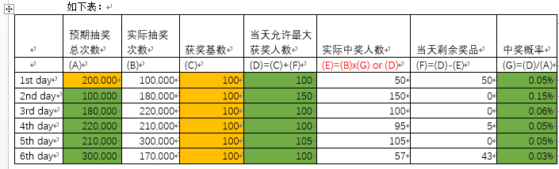

# 赛题名称：手机实物抽奖算法

## 赛题简介
运营商为了提高用户的粘性，一般会有会员积分，会员权益；会员积分可以用来购买商品，抽奖等，
通过积分消费可以增加趣味性和提高运营商的品牌。 手机实物抽奖，就是积分消费的一个使用场景，
目标是：抽奖概率固定，按照参与的人数和概率进行抽奖，要求：算法没有漏洞，概率随机。

## 赛题业务场景
对于每种手机类型的奖品，有 （当天获奖基数）， （当天允许的最大获奖人数）, （中奖率）三个参数，
其中 （当天获奖基数）每天是固定的，（当天允许的最大获奖人数） 在活动第一天与（当天获奖基数）相等，
后续动态调整；(中奖率=当天允许的最大获奖人数/第一天定义的抽奖次数)，具体规则如下：
每个抽奖活动会预先设置首次（预期抽奖总次数），接下来每天的预期抽奖总次数是前一天的实际的抽奖次数；
每日获奖基数不变，当天未抽完的奖品滚动到第二天（即：第二天的允许最大获奖人数）；
设置每日获奖基数（例如100）。活动开始第一天最大获奖人数=每日获奖基数（也就是100），当天实际中奖人数（例50），
那么需要结转到第二天的中奖数量（100-50=50），这样第二天的最大获奖人数就是 150（100+50=150）

中奖概率（G） =当天允许最大获奖人数 除以 当天预期抽奖总次数；
实际中奖人数(E) ，要充分考虑随机性进行抽取，从概率学计算获奖人数为：实际抽奖次数*中奖概率，同时最大值不能超过 
当天允许最大获奖人数。 （算法为本系统的核心，要保证有人中奖，而且要符合概率统计，无限趋近实际抽奖次数*中奖概率）
如下表:

## 基本要求
1.	抽奖系统支持输入参数：抽奖轮数（每天一轮），首轮预期抽奖次数，获奖基数； 
2.	提供参与会员的抽奖API，并实现核心的抽奖算法，返回结果：中奖，未中奖
3.	提供仿真调用抽奖API的程序，自动仿真用户抽奖次数：可以大于预期值，小于预期值；
4.	程序支持奖品滚动到第二天奖池；
5.	输出表格所示的报告；

## 非功能性要求
1.	性能要求：抽奖API能达到 10000次/秒 的抽奖；
2.	核心算法的讲解；

## 实现条件
 开发语言： JAVA/C++
 实验平台： CentOS 7.x
 可以使用：Mysql、Redis(ZCache) 等中间件

## 测试数据或平台

## 文档及其他要求
算法分析说明文档；

## 作品提交要求
1.	系统详细设计文档
2.	产品介绍PPT
3.	源文件
4.	功能演示的URL
